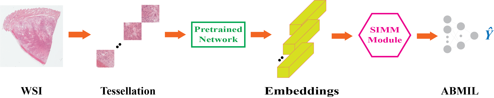
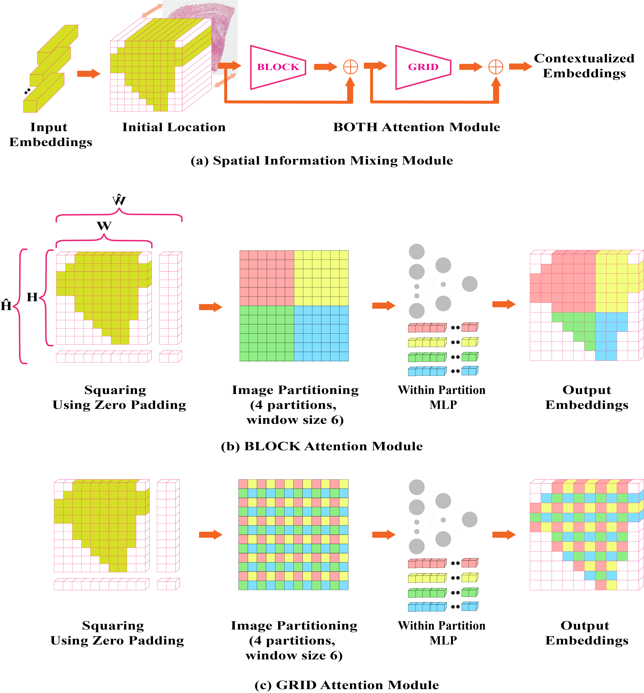

# GABMIL

This repository contains code and models for a spatially-aware Multiple Instance Learning model.

## Table of Contents

- [Overview](#overview)
- [Framework](#framework)
- [Results](#results)
- [Acknowledgements](#acknowledgements)
- [Reference](#reference)

## Overview

Global ABMIL (GABMIL) enhances Attention-Based Deep MIL (ABMIL) for whole slide image classification by modeling patch interactions without adding significant computational cost. Using a lightweight Spatial Information Mixing Module (SIMM), GABMIL improves performance by up to 7 percentage point in AUPRC and 5 percentage point in Kappa score over ABMIL, while staying much more efficient than Transformer-based methods like TransMIL.

## Framework

<p align="left">
  
  <br>
  <em>Figure 1: An overview of our GABMIL method. We first divide the input WSI into patches and extract their corresponding features using a pretrained model. The Spatial Information Mixing Module (SIMM) then integrates spatial information into the feature representations. Finally, the ABMIL model predicts the slide-level label.</em>
</p>

<p align="left">
  
  <br>
  <em>Figure 2: (a) Illustration of the SIMM (BOTH configuration). Patch features are repositioned according to their original spatial arrangement. The BLOCK and GRID attention modules are then applied sequentially to integrate spatial information into the feature representations. (b) The BLOCK attention module captures spatial information within partitioned windows using a MLP layer. (c) The GRID attention module models spatial information within each partitioned grid using a MLP layer.</em>
</p>

## Results

<em>Table 1. Slide-Level Classification Evaluation on TCGA BRCA dataset using ImageNet pretrained ResNet50 to extract instance features. The values are reported as mean ± standard deviation. The best ones are in bold. The flops are measured with 120 instances per bag, and the instance feature extraction is not considered in the presented flops.<em>

<div align="center">
  
| **Model**   | **AUC**         | **F1**          | **Recall**      | **Kappa**       | **AUPRC**       | **FLOPs** |
|:------------|:---------------:|:---------------:|:---------------:|:---------------:|:---------------:|:---------:|
| ABMIL       | 0.88 ± 0.05     | 0.78 ± 0.06     | 0.78 ± 0.07     | 0.57 ± 0.12     | 0.67 ± 0.11     | 94M      |
| TRANSMIL    | 0.89 ± 0.05     | 0.77 ± 0.06     | 0.77 ± 0.08     | 0.55 ± 0.12     | 0.71 ± 0.11     | 614M     |
| **BLOCK_3** | **0.91 ± 0.04** | **0.81 ± 0.05** | **0.80 ± 0.07** | **0.62 ± 0.10** | **0.74 ± 0.09** | **94M**  |
| GRID_4      | 0.90 ± 0.04     | 0.79 ± 0.04     | 0.78 ± 0.05     | 0.59 ± 0.07     | 0.72 ± 0.10     | 94M      |
| BOTH_4      | 0.89 ± 0.05     | 0.79 ± 0.08     | 0.78 ± 0.08     | 0.58 ± 0.16     | 0.71 ± 0.15     | 94M      |

</div>


## Acknowledgements
We would like to thank the authors and contributors of the **MLP-Mixer** and **MaxViT** for their valuable work.


## Reference

Please consider citing the following paper if you find our work useful for your project.


```
@article{keshvarikhojasteh2025spatially,
  title={A Spatially-Aware Multiple Instance Learning Framework for Digital Pathology},
  author={Keshvarikhojasteh, Hassan and Tifrea, Mihail and Hess, Sibylle and Pluim, Josien P.W. and Veta, Mitko},
  journal={arXiv preprint arXiv:2504.17379},
  year={2025}
}
```
